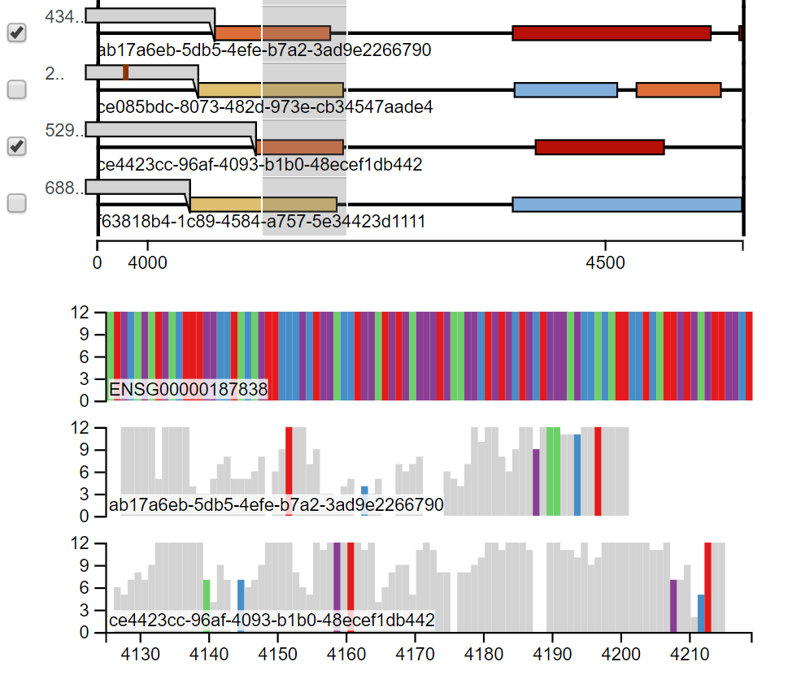

# LTR-vis
Long transcriptomic reads visualizer

<p align="center"></p>


## Demo
To view some of genes visualization download the repository and open in your browser any of the `HTML` files under `LTR-vis/LTR-vis-output/hg38-<GENE_ID>/html-cdna_ubc_01/`.

## Running the pipeline
### Pre-reqs

[Download](https://www.anaconda.com/distribution/) and [install](https://docs.conda.io/projects/conda/en/latest/user-guide/install/linux.html) `conda`. 
You don't any admin/root privileges! 

Now, install `Snakemake` and `minimap2` using `conda`
```
conda install -c bioconda snakemake
conda install -c bioconda minimap2
```

## Run stuff

Check which jobs will run:
```
snakemake -np
```

Run all jobs:
```
snakemake --use-conda [-j <number-of-threads>]
```
